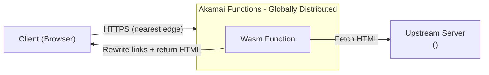

# HTML Manipulation (Reverse Proxy with Link Rewriting)

A Spin Framework (WebAssembly) HTTP component that acts as a reverse proxy, fetching HTML from an upstream server and rewriting relative links to absolute URLs.

## Architecture



The Wasm Function running on the Akamai edge node:
1. Receives any incoming HTTP request
2. Fetches the corresponding path from the upstream server
3. If the response is HTML, rewrites relative links matching `<Match Condition>` to absolute URLs using `<Your Target URL>` as the base
4. Returns non-HTML responses (images, CSS, JS, etc.) unchanged

## Prerequisites

- [Spin CLI](https://spinframework.dev/v3/install) v3.x
- [Akamai Functions CLI plugin](https://techdocs.akamai.com/cloud-computing/docs/akamai-functions) (`spin aka`)
- Node.js v18+

## Getting Started

### 1. Clone and install

```bash
git clone https://github.com/hikaneko/AkamaiFunctionsSample.git
cd AkamaiFunctionsSample/Sample/html-manipulation
npm install
```

### 2. Configure URLs and match condition

Edit `src/index.js` and replace the placeholders:

```js
const UPSTREAM_BASE = "<Your Upstream URL>";  // e.g. "https://origin.example.com"
const TARGET_BASE   = "<Your Target URL>";    // e.g. "https://www.example.com"

// Regex capturing group $1 is used in the replacement
const LINK_PATTERN = /href="(<Match Condition>)"/g;
// e.g. /href="(\/your\/path\/[^"]*?)"/g
```

Also update `spin.toml` to reflect your upstream hostname in `allowed_outbound_hosts`:

```toml
allowed_outbound_hosts = ["<Your Upstream URL>"]
```

### 3. Build

```bash
spin build
```

### 4. Run locally

```bash
spin up
```

### 5. Deploy to Akamai Functions

```bash
spin aka login   # first time only
spin aka deploy
```

## Project Structure

```
html-manipulation/
├── src/
│   └── index.js      # Wasm Function: reverse proxy + link rewriter
├── build.mjs         # ESBuild configuration (with source map shim for j2w)
├── package.json      # npm dependencies and build command
├── spin.toml         # Spin application manifest
└── knitwit.json      # WIT bindings metadata for spin-sdk
```

## How Link Rewriting Works

For every HTML response from upstream, a regex replace rewrites matching relative links to absolute URLs:

```
href="<Match Condition>"  →  href="<Your Target URL><Match Condition>"
```

Non-HTML content types pass through without modification.

## Notes

- `node_modules/`, `build/`, and `dist/` are excluded from the repository (generated at build/install time)
- The Akamai Functions deploy state is stored in `.spin-aka/` which is also excluded
- `build.mjs` includes a source map shim plugin that prevents `j2w` from failing on files in `node_modules/` that lack source maps
