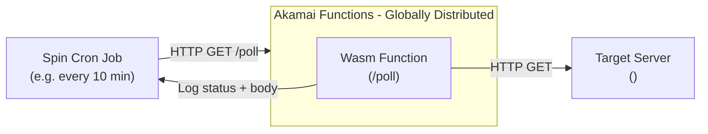

# Cron Poller

A Spin Framework (WebAssembly) HTTP component that periodically polls a target URL using Spin cron jobs on Akamai Functions.

## Architecture



The Wasm Function running on the Akamai edge node:
1. Is triggered by a Spin cron job on a configured schedule
2. Sends an HTTP GET request to the target URL
3. Logs the response status code and body (up to 200 characters)
4. Returns the result as JSON

## Prerequisites

- [Spin CLI](https://spinframework.dev/v3/install) v3.x
- [Akamai Functions CLI plugin](https://techdocs.akamai.com/cloud-computing/docs/akamai-functions) (`spin aka`)
- Node.js v18+

## Getting Started

### 1. Clone and install

```bash
git clone https://github.com/hikaneko/AkamaiFunctionsSample.git
cd AkamaiFunctionsSample/cron-poller
npm install
```

### 2. Configure the target URL

Edit `src/index.js` and replace the placeholder:

```js
const TARGET_URL = "<TARGET_URL>";  // e.g. "https://your-target.example.com/path"
```

Also update `spin.toml` to reflect your target hostname in `allowed_outbound_hosts`:

```toml
allowed_outbound_hosts = ["<TARGET_URL>"]  # e.g. ["https://your-target.example.com"]
```

### 3. Build

```bash
spin build
```

### 4. Run locally

```bash
spin up
```

Trigger the poll endpoint manually:

```bash
curl localhost:3000/poll
```

### 5. Deploy to Akamai Functions

```bash
spin aka login   # first time only
spin aka deploy
```

### 6. Register a cron job

```bash
spin aka cron create --schedule "*/10 * * * *" --path-and-query "/poll" --name "my-cron-poller"
```

Verify the cron job was registered:

```bash
spin aka crons list
```

## Cron Schedule Examples

| Expression | Meaning |
|---|---|
| `*/10 * * * *` | Every 10 minutes |
| `0 * * * *` | Every hour (at :00) |
| `*/5 * * * *` | Every 5 minutes |
| `0 0 * * *` | Every day at midnight |

> **Note:** Schedules are in UTC.

## Checking Logs

```bash
spin aka logs --app-name cron-poller
```

Example output:

```
[cron-poller] [2025-01-01T00:00:00Z] Polling https://your-target.example.com/path
[cron-poller] [2025-01-01T00:00:00Z] Status: 200
[cron-poller] [2025-01-01T00:00:00Z] Body: {"result":"ok"}
```

## Managing the Cron Job

```bash
# List cron jobs
spin aka crons list

# Delete a cron job
spin aka crons delete my-cron-poller

# Delete the app
spin aka apps delete cron-poller
```

## Project Structure

```
cron-poller/
├── src/
│   └── index.js      # Wasm Function: polls the target URL and logs the response
├── build.mjs         # ESBuild configuration (with source map shim for j2w)
├── package.json      # npm dependencies and build command
├── spin.toml         # Spin application manifest
└── knitwit.json      # WIT bindings metadata for spin-sdk
```

## Notes

- `node_modules/`, `build/`, and `dist/` are excluded from the repository (generated at build/install time)
- The Akamai Functions deploy state is stored in `.spin-aka/` which is also excluded
- `build.mjs` includes a source map shim plugin that prevents `j2w` from failing on files in `node_modules/` that lack source maps
