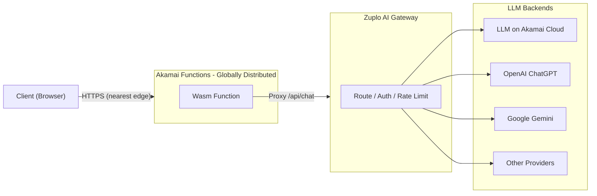

# Zuplo Wasm AI Gateway

An AI chat application running on **Akamai Functions** (Fermyon Spin / WebAssembly), using **Zuplo** as an AI Gateway to handle LLM API routing.

## Architecture



The client always connects to the **nearest Akamai edge node**. The Wasm Function running on that node proxies the request to the Zuplo AI Gateway, which handles authentication, rate limiting, and routing to the appropriate LLM backend. The upstream Gateway URL is never exposed to the browser.

## Features

- **AI Chat UI** — React-based chat interface, no build step required (CDN)
- **CORS-free proxy** — The Wasm Function acts as a reverse proxy to Zuplo, keeping the upstream URL hidden from the browser
- **Edge node info** — Displays the city and IP of the Akamai edge node where the Wasm Function is currently running

## Prerequisites

- [Spin CLI](https://spinframework.dev/v3/install) v3.x
- [Akamai Functions CLI plugin](https://techdocs.akamai.com/cloud-computing/docs/akamai-functions) (`spin aka`)
- Node.js v18+
- A Zuplo AI Gateway endpoint and API key

## Getting Started

### 1. Clone and install

```bash
git clone https://github.com/hikaneko/AkamaiFunctionsSample.git
cd AkamaiFunctionsSample/zuplo-wasm-ai-gateway
npm install
```

### 2. Build

```bash
spin build
```

> **Note:** `npm install` automatically patches a known issue in `componentize-js` where paths containing spaces cause the build to fail (the `postinstall` script handles this).

### 3. Run locally

```bash
spin up
```

Open [http://localhost:3000](http://localhost:3000), enter your API key, and start chatting.

### 4. Deploy to Akamai Functions

```bash
spin aka deploy
```

## Project Structure

```
zuplo-wasm-ai-gateway/
├── assets/
│   └── index.html        # React chat UI (single file, no bundler)
├── src/
│   └── index.js          # Wasm Function: /api/chat proxy + /api/info
├── build.mjs             # Build script (workaround for spaces-in-path issue)
├── package.json          # npm deps and build command
├── spin.toml             # Spin application manifest
└── knitwit.json          # WIT bindings metadata for spin-sdk
```

## API Endpoints

| Method | Path | Description |
|--------|------|-------------|
| `GET` | `/` | Serves the chat UI |
| `POST` | `/api/chat` | Proxies requests to the Zuplo AI Gateway |
| `GET` | `/api/info` | Returns `{ ip, city }` of the running edge node |

## How the Proxy Works

The browser sends requests to `/api/chat` with an `Authorization: Bearer <api-key>` header. The Wasm Function forwards the request body and authorization header to `https://zuplo-proxy.akamai.tech/v1/chat/completions` and streams the response back — the upstream URL is never exposed to the browser.

## Notes

- The `node_modules/` and `spin.wasm` are excluded from the repository (generated at build time)
- The Akamai Functions deploy ID is stored in `.spin-aka/` which is also excluded
